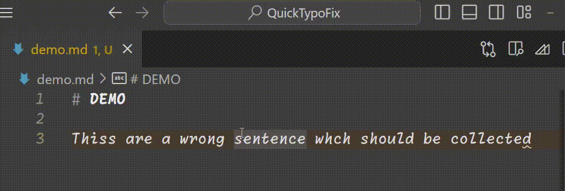
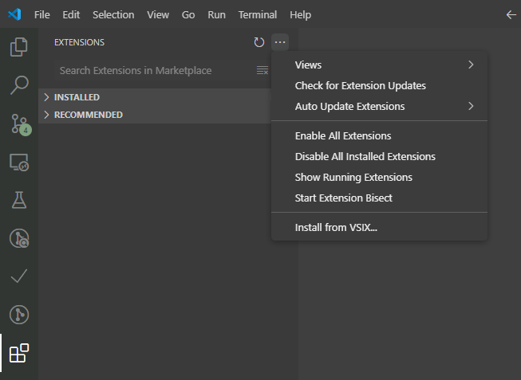

# QuickTypoFix



A versatile VSCode extension designed to instantly correct typos across all text files,
streamlining your coding workflow with seamless OpenAI-powered spell checking and customizable dictionaries.

## Features

- Quickly fix typos in your line.
- Highlights the fixed typos for a short period of time.

## Requirements

- [Visual Studio Code](https://code.visualstudio.com/)
- [npm](https://www.npmjs.com/get-npm)
  - Dependencies:
    - [vsce](https://code.visualstudio.com/api/working-with-extensions/publishing-extension)
    - [diff](https://www.npmjs.com/package/diff)
    - [node-fetch](https://www.npmjs.com/package/node-fetch)

## Installation

1. Clone the repository:

    ```sh
    git clone https://github.com/hmasdev/QuickTypoFix
    ```

2. Change to the directory:

    ```sh
    cd QuickTypoFix
    ```

3. Install the dependencies:

    ```sh
    npm install
    ```

4. Build the extension:

    ```sh
    vsce package
    ```

5. Install the extension with `install from VSIX...` in VS Code.

    

## Usage

### Preparation(Configuration)

You can customize this extension:

- **REQUIRED**
  - `quicktypofix.apiKey`: The API key for typo corrections. Default is an empty string;
- **Optional**
  - `quicktypofix.apiEndpoint`: The OpenAI-compatible chat completion API endpoint for typo corrections. Default is [https://api.openai.com/v1/chat/completions](https://api.openai.com/v1/chat/completions);
  - `quicktypofix.modelName`: The LLM model name for typo corrections. Default is `gpt-3.5-turbo`;
  - `quicktypofix.systemPrompt`: The system prompt for typo corrections. Default is 'Excellent Typo Fixer. Output the only fixed sentence without any header or any footer.';
  - `quicktypofix.highlightTimeout`: The timeout for the highlight in milliseconds. Default is 3000;
  - `quicktypofix.highlightColor`: The color for the highlight like `rgba(255, 255, 0, 0.5)` or `#FFFF00`. Default is `rgba(255, 255, 0, 0.5)`.

### Use this Extension

During writing codes or texts in VS Code, you can use the QuickTypoFix command to fix typos in the following two ways.

1. `Ctrl+Shift+P` to open the command palette, then type `Fix typo in this line` and select the command.

or

2. `Crtl+K Ctrl+N` to execute the command directly.

   - NOTE: You can remeber the shortcut by `Ctrl+K` followed by `Ctrl+N` as "これ直して（Kore Naoshite）".

After fixed, the typo will be highlighted for a short period of time. Check them.

## Development

1. Fork the repository: [https://github.com/hmasdev/QuickTypoFix/fork](https://github.com/hmasdev/QuickTypoFix/fork)

2. Clone the forked repository:

    ```sh
    git clone https://github.com/{YOUR_ACCOUT_HERE}/QuickTypoFix
    ```

3. Change to the directory:

    ```sh
    cd QuickTypoFix
    ```

4. Git checkout to the branch for development:

    ```sh
    git checkout -b {YOUR_BRANCH_NAME_HERE}
    ```

5. Install the dependencies:

    ```sh
    npm install
    ```

6. Edit the source code.

7. Test the extension:

    ```sh
    npm run test
    ```

8. Git commit and push the changes:

    ```sh
    git add .
    git commit -m "Add xxxx feature"
    git push origin add_xxxx_feature
    ```

9. Create a pull request from the following link: `https://github.com/hmasdev/QuickTypoFix/compare/master...{YOUR_ACCOUT_HERE}:QuickTypoFix:{YOUR_BRANCH_NAME_HERE}`

## License

- [MIT](./LICENSE)

## Author

- [hmasdev](https://github.com/hmasdev)
